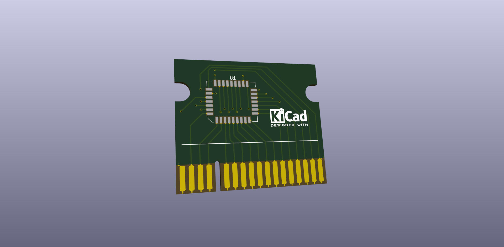

# Game Cartridge for ZX Spectrum

A clon as similar as posible to the original 16K Rom game cartridges.

Aditional capabilities (for writting on chip after solder, to select between 8 games, etc...

And a similar PCB to use with the Dandanator mini 2.0 VC interface, that use 512K, you can use for Sword of Ianna, Castelvania, Mighty Final Fight, La abadia del crimen and a lot more games.

